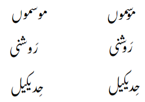
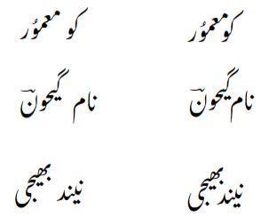

Thanks for your interest in Awami Nastaliq. The goal of this “tech-preview” release is to gain feedback on our approach to using OpenType for smart rendering of Nastaliq.

## Background

Our current officially-released font ([Awami Nastaliq 3.400](http://software.sil.org/awami))  uses the Graphite system to achieve high-quality layout with behavior characteristic of the traditional Nastaliq style. The biggest rendering challenges are collision avoidance and automatic kerning. However, the Graphite system imposes some limitations on the usefulness of the font, due to a lack of Graphite support in a wide range of applications.

Our current hope is to create a version of Awami Nastaliq that uses OpenType to fix collisions and perform kerning in a way that properly reflects the Nastaliq tradition. This requires not only loosening the kerning to avoid collisions between segments, but also tightening the kerning to create overlaps between diagonal segments, as shown in the images below.

#### Intra-word overlaps

#### Inter-word overlaps

## Status

**PLEASE NOTE:** this is a “technology preview” release meaning that it contains known bugs and infelicities. It will not be difficult to find collisions even in Urdu text. You also are welcome to try the font with other languages, but there will likely be even more collisions in that data.

We have tested the font and believe it works in LibreOffice, Chrome, Firefox, and PTXPrint. At this point we have had very limited success using it in MS Word. We would appreciate feedback on how the font works in these and any other applications of interest.

## Package contents

1. Fonts  
   a. **Awami OT TechPre AutoKern**: this font includes an auto-kerning mechanism that uses kerning to fix collisions and perform the Nastaliq-specific overlap kerning. It also includes a similar level of collision fixing for nuqtas and diacritics. We expect the performance of this font to be slower than Awami OT TechPre MinKern.  
   b. **Awami OT TechPre MinKern**: this font performs some (incomplete) collision fixing for nuqtas and diacritics, and uses hard-coded kerning to fix other collisions. It does *not* include Nastaliq-style overlap kerning of diagonal segments. This is included mainly for comparison to the auto-kerned version.  
        
   *Not included:* **Awami Nastaliq 3.400** \- this is our currently-released font that uses the Graphite system. It features fast performance and high-quality layout, but does not work in non-Graphite-enabled applications such as MS Word or Chrome. (See the [current list of Graphite-enabled applications](https://graphite.sil.org/graphite_apps.html).) It can be downloaded from [software.sil.org/awami](http://software.sil.org/awami).

2. Data files  
   a. **genesis-autokern.odt**: OpenBible Genesis in Urdu using Awami OT TechPre AutoKern \- LibreOffice format (153 pages)  
   b. **ruth-autokern.odt** \- OpenBible Ruth in Urdu using Awami OT TechPre AutoKern; LibreOffice format (12 pages)  
   c. **udhr-autokern.html** \- Universal Declaration of Human Rights (UDHR) in Urdu using Awami OT TechPre AutoKern; HTML format  
   d. **udhr-srk-autokern.odt** \- UDHR in Saraiki using Awami OT TechPre AutoKern; LibreOffice format (11 pages)
   e. **genesis-minkern.odt** \- OpenBible Genesis in Urdu using Awami OT TechPre MinKern- LibreOffice format (158 pages)  
   f. **ruth-minkern.odt** \- OpenBible Ruth in Urdu using Awami OT TechPre MinKern \- LibreOffice format (12 pages)  
   g. **udhr-minkern.html** \- UDHR in Urdu using Awami OT TechPre MinKern; HTML format
   h. **udhr-srk-minkern.odt** \- UDHR in Saraiki using Awami OT TechPre MinKern; LibreOffice format (11 pages)

## Feedback needed

We would appreciate feedback on several aspects of the fonts.

1. Appearance of the auto-kerned font \- is the output correct, readable, and attractive?  
   a. Most importantly, does the kerning look appropriate and natural?  
      1. Is it tight enough, or too tight?   
      2. Is it consistent enough to be readable and not confusing (e.g., in discerning word breaks)?  
      3. Are there specific examples where the kerning is odd or inappropriate? Please send those to us.  
   b. Basic shaping: feel free to report wrong letter forms or bad cursive connections. (Please do *not* report collisions involving nuqtas or diacritics \- we are well aware of those\! See the note above.)

2. Performance \- is the auto-kerned font fast enough, or does it seem sluggish or even unusable? Compare the AutoKern font with the MinKern version. Things to pay attention to:  
   a. Typing, especially in long paragraphs  
   b. Scrolling, especially in a long document  
   c. Opening a file  
   d. Are there specific applications in which performance is good or adequate and others in which the font is less usable?

3. Other  
   a. Are there contexts in which auto-kerning is essential?  
   b. Are there contexts in which the faster speed of the minimally-kerned version would outweigh the lack of high-quality kerning?
   c. Can you imagine a need for both versions of the font?

## Suggestions for testing

* Install the two fonts on your OS in the normal way.
* Open the two versions of the book of Ruth (using LibreOffice or some other editor) and compare the appearance and readability of the auto-kerned and minimally kerned layout. To what extent does the kerning improve the layout (or not)?  
* Using an Urdu keyboard, try typing into the file. A long paragraph will give the best information. Compare the behavior of the auto-kerned and minimally kerned fonts. Is the simpler font adequate?  
* Open the Genesis file. Does it open in a reasonable amount of time? Try scrolling down to the bottom of the document using PageDown, arrows, and the scroll bar.  
* Try the fonts with data you may have in translation or linguistics software such as Flex or Paratext. Are there contexts where the performance is better or worse?  
* Try the font in any other of your favorite applications. Do you get acceptable output? Is the performance adequate, sluggish, or completely unacceptable? Please report on any applications you try.
* If you are aware of data files that would be significantly larger than the Genesis file, try those as well.

## How to provide feedback

See the [Discussions](https://github.com/silnrsi/font-awami/discussions) page in the Awami GitHub repository and add your comments to the appropriate discussion thread. Please provide your feedback by 1 June 2026.
