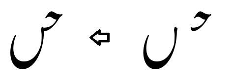

# Images of Principal Interfaces

### default (no suffix)

Connects to alef, lam, kaf, dal.

### .ai

Connects to ain.

### .be

Connects to some beh forms.

### .beM1

Connects to high-tooth behs.

### .beM2

Connects to low-tooth behs.

Several initials (beh, feh, kaf, and lam) connect to an alternate form of the final beh using a low-tooth interface.

### .benn

Connects to beh that occurs before a final noon.

###  .behg

Connects to beh that occurs before a final heh-goal.

###  .bere

Connects to beh that occurs before a final reh.

###  .beF

Connects to standard final beh.

(There is an alternate form of the final beh that essentially implements the low-tooth interface before a handful of initials (beh, feh, kaf, and lam). The initials use .beM2.)

### .by

Connects to bariyeh (final).

### .ch

Connects to final chotiyeh.

There are essentially two different interfaces; the second is used following kaf, lam, initial feh, and initial beh.

### .fe

Connects to feh and medial qaf.

### .hd

Connects to heh-doachaschmee.

### .hgM

Connects to medial heh-goal.

### .hgF

Connects to final heh-goal

### .jm

Connects to jeem.

### .mm

Connects to the standard meem.

### .mmX

Connects to the alternate medial meem (round form).

### .nn

Connects to final noon.

### .qf

Connects to final qaf and waw.

Implementationally there are two different interfaces, with the second used following seen, tah, heh doachashmee, and medial feh. However, since the shapes of the final forms are not signficantly different, possibly the two interfaces could be merged.

### .re

Connects to reh (final).

There are essentially two different interfaces; the second is used following jeem, kaf, lam, and initial beh.

### .sd

Connects to sad as well as the rounded form of kaf that occurs before a lam and alef.

### .sn

Connects to the standard seen.

### .snsn

Connects to the flat “kashida”-style seen that occurs before another seen.

### .ta

Connects to tah.

Back to discussion of [Glyph Interfaces](dev03_interfaces.md)

<!-- PRODUCT SITE ONLY
[font id='awami' face='AwamiNastaliq-Regular' size='150%' rtl=1]
[font id='awamiL' face='AwamiNastaliq-Regular' size='150%' ltr=1]
-->
