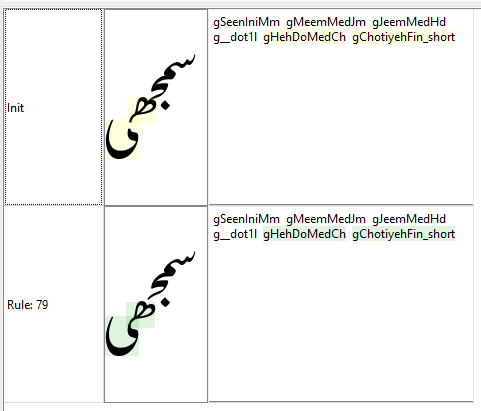

# Passes and Processing

## Substitution

As mentioned above, the substitution passes need to use backwards logic in order for the latter glyphs in the sequence to influence the previous ones. This happens particularly in passes 2-5.

**Pass 1:** the nuqtas and similar glyph elements (those that are considered an intrinsic part of the character - hamzas, maddas, rings, small tahs, squiggles, etc.) are separated from the base. The class `cNuqtaLike` contains all these. Wrinkle: in some cases we insert a glyph that represents the lack of a nuqta, for instance for a dotless qaf.

We also reorder marks to reflect the desired order described in UTR #53 - Unicode Arabic Mark Reordering.

Wrinkle: we convert any NFD forms to NFC and then reprocess. Why??? I think it simplifies the code.

**Pass 2:** here the final forms are created.

The initials and medials are replaced with pseudo-glyphs labeled “raw,” which helps us recognize which forms have been processed (or not) in later passes. There are separate initial and medial raw glyphs. 

**Pass 3:** we generate contextual forms for some finals, such as reh, beh, and chotiyeh.

We also create ligatures for sequences such as “Allah” and honorific phrases. We don’t handle tall sloping words ("Thessalonians," "Timothy") at this point because it works better to do this after we’ve generated the contextual forms.

A start-of-line slot attribute is set at the beginning of the sequence which is later used for adjusting the side-bearing of kafs and bariyehs (see pass 20).

**Pass 4:** this is where medial forms are created. Starting with the penultimate base (the last medial) we replace the raw forms and then use the GDL stream position marker (`^`) to back up the stream position to before the previous (raw) glyph.

All the rules are roughly of the form

     medial-raw  >  medial  /  ^  initial-or-medial-RAW  _  medial-not-RAW-or-final;

When we start pass 4, all the glyphs except the final are considered “raw”, so at first only the last raw medial just before the final will match any rule. After replacing that raw glyph with a medial, we back up the stream position to before the previous raw glyph. Now that newly-current raw glyph plus the following medial will match, and we back up again. The process continues until we have replaced the second glyph in the sequence. The first (an initial, of course) is handled by Pass 5.

(The actual rules are a little more complicated since we also need to handle nuqtas and diacritics.)

Here's what a five-glyph stream would look like as it is being processed in Passes 4 and 5. The bold shows the position of the processing stream and the italics show other glyphs that match the rule.

Glyph 1|Glyph 2|Glyph 3|Glyph 4|Glyph 5|Result|
:--- | :--- | :--- | :--- | :--- | :--- |
**initial-raw**|medial-raw|medial-raw|medial-raw|final|no rule matches|
initial-raw | **medial-raw** | medial-raw | medial-raw | final | no rule matches |
initial-raw|medial-raw|**medial-raw**|medial-raw|final|no rule matches|
initial-raw|medial-raw|medial-raw|**medial-raw -> medial**|_final_|a rule fires: the raw medial is processed and we back up|
initial-raw|medial-raw|**medial-raw -> medial**|_medial_|final|ditto|
initial-raw|**medial-raw -> medial**|_medial_|medial|final|ditto|
**initial-raw -> initial**|_medial_|medial|medial|final|no further Pass 4 rules will match  because there are no raw medials left;  Pass 5 handles the initial and then we are finished|

                            
**Pass 5:** generate contextual forms for the initials.

**Pass 6:** here we replace any remaining isolates with the forms that include the nuqtas. For instance, isolate seen + triple nuqta is turned into an isolate sheen.

On the other forms, we replace any combinations of upper+lower nuqtas (e.g., tteh, noon-ring) with separate glyphs for the upper and lower so that we can adjust their positions independently.

We insert a null kaf-top glyph which can be used to create the alternate-height kafs/gafs. We need to insert it during the substitution process since insertion is not allowed during positioning.

Now that we have all the contextual forms, it is a good time to generate ligatures for tall sloping words for which we specially designed forms, such as “Thessalonians” and “Timothy.”. Normally we do ligature placement in Pass 3, but (if I remember correctly) some of the sub-forms of “Thessalonians” (“Thessaloni”) would have to be handled by the medial-replacement rules, which would get complicated.

This pass also handles spanning signs for data in right-to-left order. (This shouldn’t be necessary, but some applications incorrectly pass this data in RTL order instead of LTR.)

**Pass 7:** this is a left-to-right pass, so it assumes the data is being sent in left-to-right order. It handles spanning signs where the data is LTR and converting from Arabic and Latin punctuation, which is needed for Latin text. It also handles Latin diacritics.

Note that Latin data, which is supported by this font, will generally not match any of the rules in the right-to-left passes (1-6). Similarly, Arabic data will not match rules in Pass 7.

## Positioning

(In the following discussion, the overall pass number of each pass is shown in parentheses, since that is what is shown in Graide.)

**Pass 1 (8):** Basic cursive attachment happens at this point, using the “interfaces” described in [Glyph Interfaces and Suffixes](dev03_interfaces.md).

Note that in the font itself, the attachment points are labeled specifically according the interface involved (e.g., `exit_behFinal`, `exit_meem`), but the step that auto-generates the GDL code from the font simplifies these down to simply `exit` and `entr`. The GDL rules know which forms to attach to which.

While we do the attachments, we keep a running calculation of the length of sequences and store it in a user-defined slot attribute `seqWidth` (`user5`). This is used later in the process to fine-tune kerning.

This is also a good opportunity to initialize some attributes on spaces since they are not involved in the cursive attachment.

### Passes 9 - 11: Nuqta positioning

**Pass 2 (9):** Next we attach nuqtas (and similar graphical elements that are considered inherent parts of characters).

The bariyeh requires a fair bit of special treatment because of the fact that nuqtas in preceding glyphs need to be attached below its tail. This can affect several characters prior to the bariyeh.

Other elements that need special attention are hamzas, bars, digits, rings, and hooks.

This pass is a convenient place to deal with spanning signs, since they don’t interact with nuqtas.

**Pass 3 (10):** This pass is used to set the attributes that are used for collision fixing on the nuqtas and similar elements (rings, hooks, bars, etc.).

Before getting into the rules themselves, the glyph table is used to set a lot of default values of collision attributes. The class and order attributes indicate that the nuqtas are to be positioned closer to the base than diacritics, which are handled later. Of special note is the fact that nuqtas should be laid out in a sequence (we don't want them to flip around each other right to left, which is possible!), and so we use the sequence attributes to define their relationships to each other. To further complicate the process, alternate-tooth behs are put in different sequence classes so that their associated nuqtas also alternate in height.

As a rule, nuqtas tend to be positioned slightly to the left of their base glyph. It’s okay for those on initials to be shifted further to the right if necessary.

There are quite a few special cases, where the legal destination box needs to be adjusted or the margin increased to make the result more clear. Sometimes the nuqtas are explicitly shifted before the collision avoidance algorithm is run.

In this pass, the exclusion glyphs come into play. They in effect extend the black space associated with a glyph so that the collision avoidance routine will treat the extended space as off-limits. Right now exclusion glyphs are used only for kafs and gafs. They extend the tops of the kafs and gafs so that nuqtas will not be placed above them.

**Pass 4 (11):** The actual collision-fixing algorithm is run. It could be included as part of the previous pass, but using a separate pass for it makes debugging easier in Graide.

### Passes 12 - 14: Height-related adjustments

For a more extensive discussion of kaf alternates, see below.

There are two user-defined slot attributes that are used for this mechanism:

- `tooHigh` (`user3`) is set to true when we recognize that a glyph is so high that it may extend above the ascent height defined for the font, risking being clipped or creating a collision with the line above. We use to the read-only `position.y` attribute to figure this out.
- `reattached` (`user4`) is needed because when we substitute short forms in pass 6, they effectively become detached from their previous glyph. The `reattached` attribute helps us keep manage the process of reattaching them.

**Pass 5 (12):** First we substitute taller kafs in situations where we need them - where they are preceded by nuqtas and diacritics for which there is not space. (See [Alternate Height Kafs and Gafs](dev09_altkafs.md)).

Then we substitute shorter kafs in situations where the sequences get too high, or to avoid collisions between adjacent kafs and gafs.

(It’s possible that it would make sense to move the kaf alternates before positioning the nuqtas. We do need to take the presence of nuqtas into account, but the exact position of them is usually not significant, except in a few special cases where nuqtas are shifted in addition to changing the height of the kafs. The kaf changes definitely need to happen after the cursive attachments, since we need to do that before we can figure out how high things are.)

Once nuqtas and similar elements have been positioned more-or-less correctly, we can turn off the collision fixing for most of them. The exceptions are the ones that are close to the adjusted kafs, since the new kafs may have created collisions that weren’t there before.

**Pass 6 (13):** The main thing this pass does is to make adjustments for sequences that are too high. As an efficiency measure, the pass is not run if the feature is turned off.

One of the adjustments is the substitution of a short final form (see [Short Finals](dev10_shortfinals.md)). The tricky thing is that while the final form is the glyph that will be modified, it is the _beginning_ of the sequence where we recognize that the sequence is too high. So during this pass we propagate the `tooHigh` flag from where we detect the problem down to the final glyph in the sequence. 

Another kind of adjustment we make is to push down nuqtas and diacritics at the beginning of the word that stick up too high.

**Pass 7 (14):** There are two kinds of attachments that need to happen in this pass.

First we attach the kaf bases to their preceding bases, if any. We have to do this in a separate pass from the one where the substitution was made, due to an infelicity in the Graphite engine.

Then we attach the alternate height kaf tops to their bases. 

We also have to reattach sequences to any short final forms that have been substituted. Even though the attachment is still present in the data (in the sense of a reference to the parent glyph), unfortunately it has to be redone in order to force the engine to recalculate the position of the penultimate base glyph. The same applies to nuqtas and similar elements.

_Graide shows the necessity of reattaching short finals. (Although the jeem form, third from the end, appears to need reatttaching as well, in fact it doesn't.)_

### Passes 15 - 19: Diacritic positioning and kerning

**Pass 8 (15):** Diacritics are attached. Most diacritics are attached using the `mLower` and `mUpper` AP pairs. Dagger alefs can also use the `mUpperLam` since it is positioned specially on the lam (slightly to the left). Diacritics on alternate-height kafs/gafs must be attached to the top, not the kaf base.

There are a few special positioning cases that are handled in this pass.

**Pass 9 (16):** This is a pass that does two left-over things that are difficult to do in previous passes:

- Hamzas sometimes behave like nuqtas and sometimes like diacritics. In this pass any hamzas that were not treated like nuqtas will be attached like diacritics.
- Reattaching certain marks to alternate height kafs (normally occurring in the previous pass) doesn’t happen properly when the kaf is followed by another kaf or gaf, due to the complexity of the rules. In this pass we just reattach them all.

**Pass 10 (17):** this pass sets up kerning pairs which will actually be used in the final collision-fixing pass. The kerning-pair mechanism makes use of a group of custom glyph attributes that are needed for specific tricky glyphs:

- `kernPreAlef` - kerning needed before isolate alef forms
- `kernPreDal` - kerning needed before isolate dal, thal, etc
- `kernPreZain` - kerning needed before isolate zain, jeh, etc.
- `kernPreReh` - kerning needed before isolate reh forms (other than the ones included in the zain list)
- `kernPreWaw` - kerning needed before isolate waw forms
- `kernPreJeemAinIso` - kerning needed before isolate jeem and ain forms
- `kernPreLamAlef` - kerning needed before lam-alef ligature
- `kernPreExclam` - kerning needed before Arabic exclamation mark
- `kernPreMeemJeem` - kerning needed before isolate meem or initial jeem

These glyph attributes are set to zero for the vast majority of glyphs, but certain ones are assigned other values. There is also a user-defined slot attribute called `pairKern` that takes this value in the appropriate context. The `pairKern` attribute is available to all the rules that set up the kerning done by the collision-fixing mechanism. There are also a few situations where `pairKern` is set directly.

_Example:_ gWaw is assigned the glyph attribute `kernPreAlef = -30m`. When it is followed by an isolate alef form, the rule in pass 10 setting the `pairKern` slot attribute is fired:

`cKernable { pairKern = kernPreAlef } /  _ ^ MARKS cKernIgnore? cAlefIso;`

Then in pass 11, `pairKern` is used to calculate the `collision.margin` that is needed.

This pass also includes a lot of special cases where diacritics need to be shifted around that won’t be handled adequately by the collision fixing mechanism.

**Pass 11 (18):** this pass sets up collision fixing parameters for diacritics and kernable glyphs.

There are quite a few special cases that are handled in this pass by adjusting the `collision` parameters.

**Pass 12 (19):** this pass runs the collision fixing for diacritics and kerning. (Again, it could be included as part of the previous pass, but using a separate pass for it makes debugging easier in Graide.)

## Final passes

There are a few tricky bits that interact with the other passes such that it helps to move them into their own passes.

**Pass 13 (20):** There are a handful of glyphs with shapes that need special treatment with regard to the right margin. Back in Pass 3 we marked the very first glyph in the data with a slot attribute called `startOfLine`. In this pass, any of certain initial glyphs are adjusted relative to the right (leading) margin by modifying their advance widths. For instance, the beh+kaf combination needs to be shifted left to accommodate the upper kaf stroke, rather than aligning the right side of the beh with the margin. Also there are some nuqtas on initial forms, such as the peh, that require the margin to be adjusted.

**Pass 14 (21):** Kerning of certain low punctuation has to be redone after the main kerning pass (pass 19) in order to correct over-kerning that happens there.

--------

<< Previous: [Naming Conventions](dev05_namingconv.md) | [Introduction and Index](dev01_intro.md) | Next: [Collision Fixing](dev07_collisions.md) >>

<!-- PRODUCT SITE ONLY
[font id='awami' face='AwamiNastaliq-Regular' size='150%' rtl=1]
[font id='awamiL' face='AwamiNastaliq-Regular' size='150%' ltr=1]
-->
