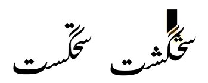

# Collision Fixing

To understand Awami's collision fixing process, you’ll need to have an understanding of Graphite’s collision avoidance mechanisms. Documentation of this is available in the GDL manual and is not duplicated here. This section gives a high-level overview of the process.

A general principle is that the bases are held in place and moveable elements - nuqtas, diacritics, hamzas, and other modifying marks are shifted to avoid collisions. Elements that are directly attached to the bases, such as bars and rings, do not get moved. The same is true of the gaf strokes which are sometimes rendered as separate glyphs. Some elements such as the small V above a lam cannot be moved much because shifting the V off center would not produce a pleasing result.

We perform collision avoidance in three rounds. GDL allows us to set the relevant attributes and perform the fixes in the same pass, but we divide the process into two (or more) passes for the sake of debugging.

Remember that collision avoidance only occurs in the positioning table.

**Round 1 (passes 3 & 4):** The first round fixes collisions for nuqtas and similar inherent glyphs (hamza, heh hook, small V, etc.). The bulk of the pass involves special cases where the default collision parameters aren’t adequate to give a good result. The default rules are found near the bottom of pass 3. 

**Round 2 (passes 11 & 12):** The second round mainly deals with collisions involving diacritics. Most of pass 11 involves setting the collision attributes for diacritics. The default rules are at the bottom of the pass.

We also set collision attributes in pass 10 to handle some special cases.

Unlike pass 4, the collision-fixing in pass 12 also performs kerning (see [the section on Kerning](dev08_kerning.md)). This is used to both fix collisions and improve the spacing.

There are also some cases where we essentially redo nuqta-type fixes:

- If a glyph is near an alternate-height kaf or gaf, the substituted kaf might have introduced a new collision.
- Nuqtas attached to newly substituted short finals may fit differently now and need adjustment.
- Hamzas that are treated like diacritics need to be handled, since they may be attached differently than previously.

**Round 3 (passes 13 &14):** The final collision-fixing pass handles a couple clean-up operations:

- Adjustments to the right-hand margin
- Adjustments to the kerning of low punctuation (full-stop and comma)

Since it handles such a few cases, pass 14 sets some rules and runs the collision algorithm both in the same pass.

## The kaf exclusion mechanism

A particular challenge has to do with the space above a kaf or gaf. Moveable glyphs often get squeezed underneath a kaf, and the collision avoidance algorithm would naturally move them above the diagonal stroke, resulting in a misleading layout.

To solve this problem, we essentially extend the space “owned” by the kaf using the exclusion mechanism. This uses a special glyph, `g__kaf_exclude`, that is not actually rendered but is added in to the “ink” of the kaf when performing collision avoidance. This is set using a statement such as:

`g_kafMed {collexclude.glyph = g__kaf_exclude};`

Including this extra ink in the kaf, computationally speaking, generally has the effect of moving preceding glyphs down and right rather than up above the kaf.

On the other hand, characters such as kaf with three dots above and ngoeh (gaf with two dots above) do in fact want their associated nuqtas to be placed in directly above the base, and so we must omit the exclusion glyph in these situations (otherwise those nuqtas would get moved to an extreme position far above the exclusion glyph).

_Right: The exclusion area, shown in Graide (but not in the final rendering), prevents the nuqtas on the hah form from jumping above the kaf's diagonal stroke in order to fix the collsion. Left: The ngoeh needs the nuqta to be positioned above the diagonal stroke, so the exclusion area is omitted._

--------

<< Previous: [Passes and Processing](dev06_passes.md) | [Introduction and Index](dev01_intro.md) | Next: [Kerning and Overlaps](dev08_kerning.md) >>

<!-- PRODUCT SITE ONLY
[font id='awami' face='AwamiNastaliq-Regular' size='150%' rtl=1]
[font id='awamiL' face='AwamiNastaliq-Regular' size='150%' ltr=1]
-->
