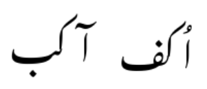
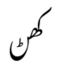
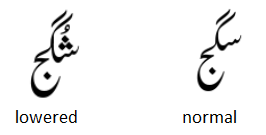

# Alternate Height Kafs and Gafs

One of the challenges of Nastaliq script is that long contextual sequences can get quite high and either be clipped or collide with the line above. Kaf and gafs are a particular problem because of their tall shape.

A different problem is that the upper diagonal stroke of the kaf may not allow enough room above preceding glyphs for a stack of large nuqtas and diacritics.

In some styles of Nastaliq, a “bent” or flattened kaf shape is used to avoid the first problem in particular. For Awami Nastaliq, we have instead chosen to support a variety of kaf heights, which helps solve both problems.

The approach is to create a set of bases that correspond to each kaf shape, along with a set of kaf and gaf tops consisting of just the stem and upper diagonal stroke. The tops are attached to the bases using an attachment point called `kafTop`.

Because these forms are admittedly not quite as perfectly shaped as a single kaf form, this approach is only used when we need an alternate-height glyph, not for the default, standard-height shapes.

For comparison, here we can see five versions of the kaf; the middle form is the default shape and height. (Notice that for the shortest form, the short form of the seen has been used as well; see the following section.)

<figcaption>Five heights of the kaf</figcaption>

Several defined constants in the code (`SHORTKAF_HT` and `SHORTERKAF_HT`) are used to recognize situations where an adjustment is needed. These were calculated empirically based on the vertical size of the kaf glyphs and the defined ascent of the font.

There are five alternate-height kafs:

**Tall:** these are used when preceding glyphs have a stack of nuqtas and diacritics that would collide with the upper stroke of the kaf, and/or to avoid a collision with a previous kaf or gaf.

These alternates are not dependent on a feature being set. They only exist for medials.

<figcaption>Tall kafs and gafs</figcaption>

**Taller:** these are used to avoid collisions or extreme kerning with very tall previous items such as alef-madda or alef with a diacritic. They only exist for initials, and are not dependent on a feature.

<figcaption>Taller kafs and gafs</figcaption>

**Medium/short:** (\_medshort): these kafs have a standard-height stem, but the diagonal stroke has been shortened to avoid colliding with a previous tall glyph (lam, tah, kaf, or gaf) or large nuqat. These only exist for medial forms, and they are not dependent on a feature being set.

<figcaption>Kafs and gafs with shorter diagonal strokes</figcaption>

**Short:** these are used when the contextual sequence gets high enough to risk clipping or collisions. They are only used when the “Short Forms” feature is set to “Kaf and gafs” or “All.” For obvious reasons, they are most often used for kafs near the beginning of the sequence, but they can be needed for both initials and medials.

<figcaption>Short kaf</figcaption>

**Shorter:** these forms are used when the short forms don’t provide quite enough adjustment due to an extremely high sequence.

<figcaption>Shorter kaf</figcaption>

The short and shorter forms are also used for gafs in combination with the tall or medium/short forms to avoid collisions.

<figcaption>Short/shorter gafs used to avoid collisions with following kafs and gafs</figcaption>

What happens when you need a tall kaf to avoid a collision, but this causes the text to be too high which would normally be solved using a short kaf? The answer is that fixing collisions is the priority, so a tall kaf is used.

<figcaption>The sequence on the right uses a "shorter" kaf due to the height, but the center and left-most sequences use the standard and tall kaf (respectively) due to the presence of the sheen and diacritic.</figcaption>

## Special cases of alternate kafs

Some of the kaf forms do not lend themselves to this approach - they are shaped differently enough from the other forms, or are naturally enough shorter, that there is no good way to break them into base + top in a way that is consistent with the other kaf forms. For these, the kaf base is simply a complete form and it is followed by a glyph called `g__kafTop_m_bogus` in lieu of the top. (The reason for including this bogus glyph is that these special forms are created during the positioning pass, and glyph deletion is not possible at that point.)  These unbroken forms are:

- gKafIniMm_short, gGafIniMm_short
- gKafMedJm_short, gGafMedJm_short
- gKafMedJm_tall, gGafMedJm_tall
- gKafMedJm_lowentry, gGafMedJm_lowentry - these have a lower entry AP for the previous glyph to be attached to, rather than a taller stem, which has the same effect of allowing extra space below the diagonal stroke

Compare the "lowered" and normal forms below. Notice how the entry of the lowered form effectively creates a taller kaf.

<figcaption>Lowered and normal forms of the pre-jeem medial kaf.</figcaption>

Note that these are not repositioned or reattached, so their exit APs must be in the same position as the standard forms they are replacing.

There are a couple cases where we never make a change to the default form:

- gKafIniBy, gGafIniBy - these forms are always the penultimate of the sequence (since bariyehs are finals), so shortening them is never necessary, and making them taller is never necessary since they are initials and will never have anything preceding.

## A note about kaf glyph outline vertical positioning

You’ll notice that for most characters, the initials and medials appear to be at random or arbitrary vertical positions in the UFO files. This happened for historical reasons, and it’s generally not a problem because ultimately the vertical positioning is controlled by the attachment mechanism. In other words, initials and medials are always attached to a following (medial or final) glyph which effectively anchors their vertical position; until then they are essentially floating in space.

However, this was less than ideal when we started working with alternate height kafs. We use the `position` attribute to evaluate the vertical height of kafs that may need to be adjusted, and assume a standard height of the kaf stem and diagonal stroke. But if the outline of the kaf is not at a predictable position relative to that `position.y` attribute, we’d get unpredictable results. We could get around this by including the bounding box in the calculation, but it simplifies things to ensure that all the kaf glyphs are a consistent height from the baseline. Specifically, all the `_exit_lamKaf` anchors are at exactly 686 in Regular and 720 in Bold, and the highest nodes are at 2214 in Regular and 2327 in Bold. (Exceptions are some kehehMed.jm forms that are handled specially.) This way we can build in an assumption of the absolute height of the kaf based on the `position.y` attribute.

Another case where the position of the glyphs in the UFO matters is where the kaf-base (to which the alternate height kaf-top is attached) connects to the following glyph. We don’t reattach the kaf-base, so it needs to be in the exact position that the original kaf was. This is especially noticeable for the .snsn forms, whose interface is unforgiving.

------

<< Previous: [Kerning and Overlaps](dev08_kerning.md) | [Introduction and Index](dev01_intro.md) | Next: [Short Finals](dev10_shortfinals.md) >>

<!-- PRODUCT SITE ONLY
[font id='awami' face='AwamiNastaliq-Regular' size='150%' rtl=1]
[font id='awamiL' face='AwamiNastaliq-Regular' size='150%' ltr=1]
-->
