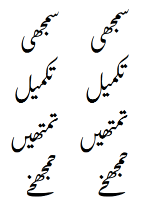

# Short Finals

Another technique to minimize sequence height is to use short versions of final forms. The following glyphs exist for this purpose:

- absJeemFin_short
- absSeenFin_short
- absSadFin_short
- absAinFin_short
- absQafFin_short, absQafFin_stfh_short
- absLamFin_short
- absMeemFin_short
- absNoonFin_short
- absChotiyehFin_short, absChotiyehFin_bfkl_short
- absJeemMed.by_short - this is not a final form, but is used just before a bariyeh which is always a final form

Sequences with and without short finals:

_Short (left) and normal (right) finals_

The tricky thing about these forms is that the glyphs themselves are not the ones that are too high, rather it is a previous glyph in the sequence that is the problem. So this 
information must be recognized at the point of positioning that previous glyph and then propagated down the glyph stream. This is done using a user-defined slot attribute called `tooHigh` (`user3`).

These short forms are not created unless the “Short Forms” feature is set to “Finals” or “All.” (“All” is the default as of version 3.000.)

There are several defined constants that are used to recognize situations where short finals are needed:

- `SHORTFINAL0` - for  considering high forms with no nuqta or diacritic
- `SHORTFINAL1` - for considering high forms with one nuqta or diacritic
- `SHORTFINAL2` - for considering high forms with two or more nuqtas and/or diacritics
- `SHORTFINAL_KAF` - for considering high kafs

If the vertical position of the top of the bounding box of the glyph in question is higher than the constant, a short final is appropriate. These values were determined empirically based on the ascent of the font and the sizes of various glyphs.

Note that short kafs and short finals are two different ways of solving the same problem. If the “Short Forms” feature is set to “All,” the result for a tall sequence may be a short kaf, a short final, or both--depending on the height of the sequence and whether the final character is one that can be shortened.

------

<< Previous: [Alternate Height Kafs and Gafs](dev09_altkafs.md) | [Introduction and Index](dev01_intro.md) | Next: [Testing](dev11_testing.md) >>

<!-- PRODUCT SITE ONLY
[font id='awami' face='AwamiNastaliq-Regular' size='150%' rtl=1]
[font id='awamiL' face='AwamiNastaliq-Regular' size='150%' ltr=1]
-->
