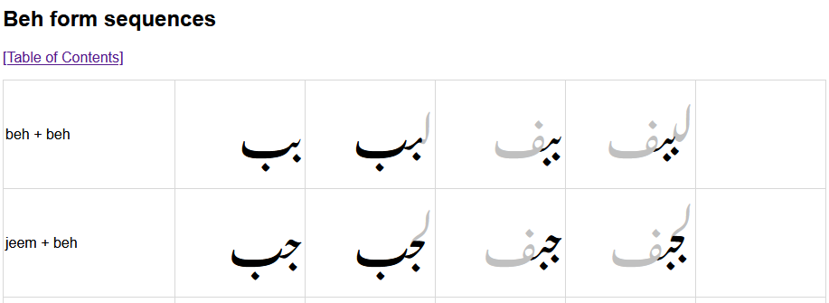

# Testing

## FTML files

FTML is a system for applying an XSL stylesheet to an XML file to display rendered text in a way useful for testing a font. See the [FTML GitHub repository](https://github.com/silnrsi/ftml/blob/master/README.md).

A Python script called ftml_test_gen.py generates a suite of FTML files that can be used for testing the Awami font. This script is located in tests/scripts. Runing the script from the root directory of the project with no output argument supplied will put the results in tests/FTML_XSL.

    python3 tools/scripts/ftml_test_gen.py

There is a set of files that can be generated that include different combinations of characters. The -mode argument indicates which is wanted.

- **basicforms:** all contextual forms of the most basic shapes (beh, jeem, seen, etc.).
- **allbasechars:** some contextual forms of all letters; this is useful to make sure that nuqtas an other inherent shapes are generated.
- **basic_somediac:** this generates the same characters as basicforms, each with an upper and lower diac.
- **allbasecharforms:** all forms of all letters; this generates a *huge* file.
- **basic_alldiac:** generates same characters as basicforms, with every diacritic.

Running without specifying a mode will generate all five files. By default, the resulting files are named test_MODE.xml (test_basicforms.xml, test_allbasechars.xml, etc.) and are output to tests/FTML_XSL.

The **ftml.xsl** file must be located in the same directory as the .XML files. When it is, opening the XML _in Firefox_ will use the XSL to generate a nice display of the various character combinations. Note that FTML files do not work in other browsers such as Chrome. Firefox is also needed because it supports Graphite which is necessary to handle Awami.

Also note that the ftml.xsl file for the Awami project is somewhat different than that used by other SIL font projects. It creates a table with four rendered cells per row. Each row shows the letter combination in isolate, final, initial, and medial position. 

Irrelevant cells are colored gray.

### The ftml_test_gen.py program

TO BE COMPLETED...

------

<< Previous: [Short Finals](dev10_shortfinals.md) | [Introduction and Index](dev01_intro.md)

<!-- PRODUCT SITE ONLY
[font id='awami' face='AwamiNastaliq-Regular' size='150%' rtl=1]
[font id='awamiL' face='AwamiNastaliq-Regular' size='150%' ltr=1]
-->
