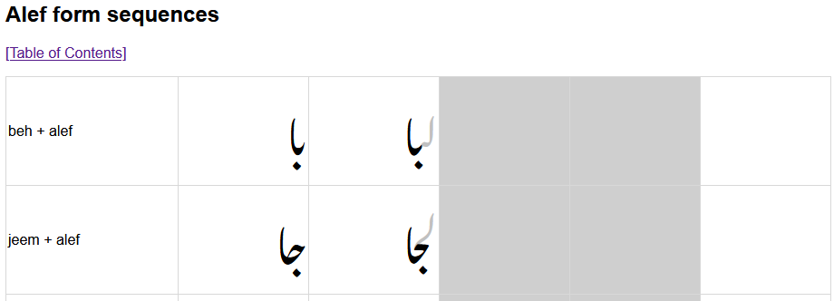

# Testing

## FTML files

FTML is a system for applying an XSL stylesheet to an XML file to display rendered text in a way useful for testing a font. See the [FTML GitHub repository](https://github.com/silnrsi/ftml/blob/master/README.md).

A Python script called **ftml_test_gen.py** generates a suite of FTML files that can be used for testing the Awami font. This script is located in tests/scripts. Runing the script from the root directory of the project with no output argument supplied will put the results into tests/FTML_XSL:

    python3 tools/scripts/ftml_test_gen.py

There is a set of files that can be generated that include different combinations of characters. The --mode argument indicates which is wanted.

- **basicforms:** all contextual forms of the most basic shapes (beh, jeem, seen, etc.).
- **allbasechars:** some contextual forms of all letters; this is useful to make sure that nuqtas an other inherent shapes are generated.
- **basic_somediac:** this generates the same characters as basicforms, each with an upper and lower diac.
- **basic_alldiac:** generates same characters as basicforms, with every diacritic.
- **allbasecharforms:** all forms of all letters; this generates a *huge* file, so it is of limited usefulness.

Running without specifying a mode will generate all five files. By default, the resulting files are named test_MODE.xml (e.g., test_basicforms.xml, test_allbasechars.xml, etc.) and are output to tests/FTML_XSL.

The **ftml.xsl** file must be located in the same directory as the .XML files. When it is, opening the XML _in Firefox_ will use the XSL to generate a nice display of the various character combinations. Note that FTML files do not currently work in other browsers such as Chrome. Firefox is also needed because it supports Graphite which is necessary to handle Awami.

Also note that the ftml.xsl file for the Awami project is somewhat different than that used by other SIL font projects. It creates a table with four rendered cells per row. Each row shows the letter combination in isolate, final, initial, and medial position. Somewhat arbitrarily, the preceding letter lam and the following letter feh are used to create the initial, medial and final contexts.

Irrelevant cells are colored gray.

### The ftml_test_gen.py program

A script called **ftml_test_gen.py** is used to generate the various FTML files. If you run it from the root directory with no arguments, it will produce the five formats listed above. You can also supply various parameters:

- **-m** or **--mode**: which mode of output to generate
- **-o** or **--output**: output file
- **-t** or **--text**: generate a simple text file instead of FTML
- **-f** or **--font**: name of font (defaults to "Awami Nastaliq")
- **-s** or **--scale**: scaling factor (defaults to 300)

The basic approach is to create sequences of basic characters (mostly pairs, but some longer), modify or expand it to include the various combinations depending on the mode we are operating in, and then generate a file with four versions of the sequence, with and without an arbitrary initial and final (we use lam and feh just because they have fairly neutral looking connections). The output is organized according to the final character in the sequences which is normally what defines the "interface."

Each sequence is put into a <testgroup> XML structure:

    <testgroup label="jeem + beh">
      <test rtl="True"><string><em>&#x062C;&#x0628;</em></string></test>
      <test rtl="True"><string>&#x0644;<em>&#x062C;&#x0628;</em></string></test>
      <test rtl="True"><string><em>&#x062C;&#x0628;</em>&#x0641;</string></test>
      <test rtl="True"><string>&#x0644;<em>&#x062C;&#x0628;</em>&#x0641;</string></test>
    </testgroup>

which is transformed via XSL into a row in a table with a cell for each of the contexts:

The "basic characters," of course, are beh, jeem, sad, seen, tah, ain, feh, lam, meem, kaf, heh-doachashmee, heh-goal, alef, dal, reh, qaf, waw, bariyeh, chotiyeh, noon, and teh-marbuta. These are divided into dual-connecting and right-connecting groups. All other characters are associated with one of the basic characters. There is a group of initial/medial forms that are associated with a different basic form from the final (e.g., noonIM is an alternate of beh, qafIM is an alternate of feh, etc.).

For **basicforms** mode, the only modification that is needed is to change some of the kaf sequences to use gaf instead.

For **allbasechars** mode, we cycle through all the sequences and replace most of the basic characters with an alternate form. For instance, we replace instances of beh with teh, dotless-beh, tteheh, teh3down, etc; we replace jeem with hah, khah, tcheh, dyeh, etc. The goal is not to include every combination but make sure both basic and alternate characters are included. Note that the structure and contents of the **basicforms** and **allbasechars** files are similar, the difference is that **allbasechars** includes a wider variety of characters.

For **basic_somediac** and **basic_alldiac**, we generate the same sequences as **basicforms** but duplicate each sequence by including diacritics on each character. The **basic_somediac** format essentially duplicates **basicforms** but with zabars and zers on each base character, so it is about twice as long.

The sequences are generated in terms of the first character in the sequence, but they need to be output in groups based on the "interface," the last in the sequence. (Why did I write it this way? I don't remember.) The sort keys in _group_name_format() are used to sort things.

#### Adding new characters to the tests

When the font is extended to handle additional characters, those characters should be added to the test-generation script. They need to be added in three places:

- _char_name_to_usv(): define a short code for it and add the corresponding USV mapping. Keep in mind that characters with varying finals (yeh, noon, qaf) need to be handled twice (e.g., add both noonAlt and noonAltIM).
- expand_sequences() or insert_diacritics(): add the code for it into the appropriate list.
- _group_name_format() or _diac_group_name_format() - add the appropriate information. (Note that for base characters, the last two numbers of the tuple indicate how many cells are needed in the table row. Dual-connecting characters need 2 each of right-connecting and left-connecting (... 2, 2), right-connecting characters need 2 right-connecting and no left-connecting (... 2, 0), and initial/medial alternates need 2 left-connecting and no right-connecting (... 0, 2). However, it looks like these numbers are never used.)

#### Kludge for initial/medial-only alternates

A tricky thing to be aware of happens with the **allbasechars** mode. When substituting initial/medial forms where the final has a distinct form (noon, yeh, qaf, etc.), special care must be taken. The character is appropriate to be substituted in the initial/medial position, and indeed we do want the substitution to happen so it can be tested. But the final form will not be the expected one. 

For example: we want to generate test samples with various feh shapes (including qaf). One of these sequences might be based on **sad + feh**, and we want to generate samples like **sad3dots + qaf**, e.g.,

- arbitrary-initial + sad3dots + qaf + arbitrary-final
- sad2dots + qaf + arbitrary-final
- **arbitrary-initial + sad3dots + qaf**
- **sad3dots + qaf**

The bolded sequences above are problematic. When the qaf occurs in the medial position there's no problem, but when it occurs in the final position (the bold-face items above), we don't actually end up with a feh shape, but rather a qaf shape.

It is only in the last step of the process that we distinguish between the main sequence occurring in the various positional contexts. So at that point we revert the final qaf to a final feh (the most basic form) instead.

------

<< Previous: [Short Finals](dev10_shortfinals.md) | [Introduction and Index](dev01_intro.md)

<!-- PRODUCT SITE ONLY
[font id='awami' face='AwamiNastaliq-Regular' size='150%' rtl=1]
[font id='awamiL' face='AwamiNastaliq-Regular' size='150%' ltr=1]
-->
